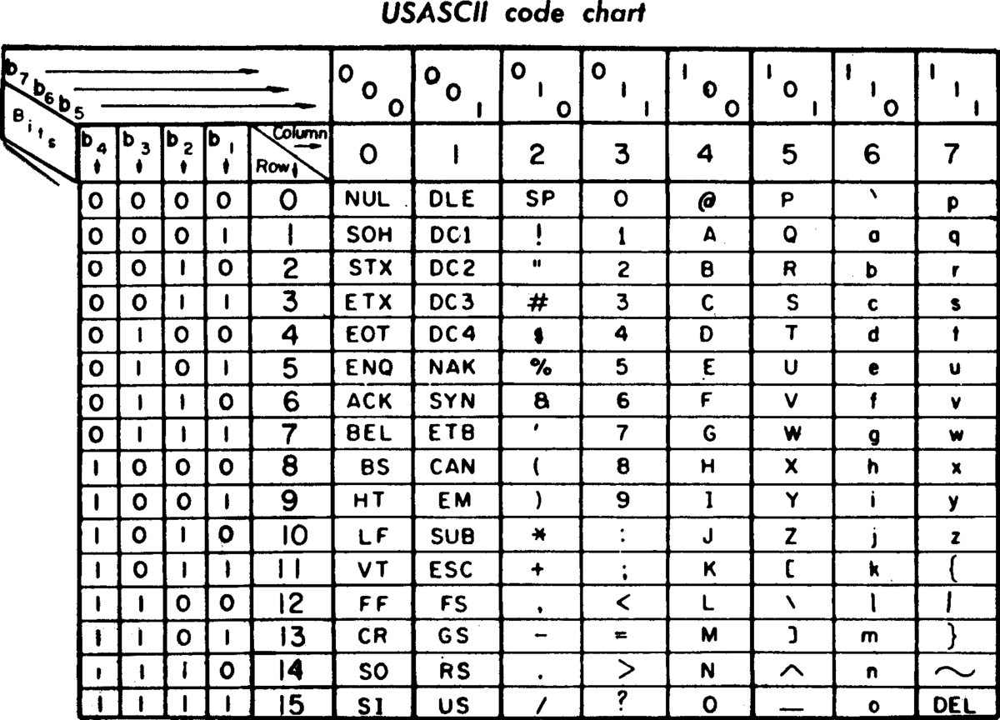
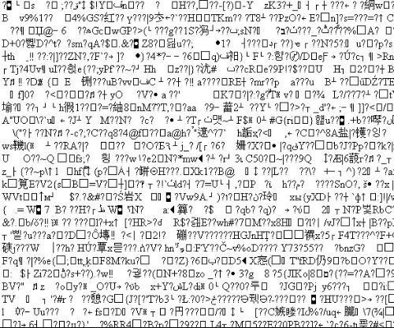
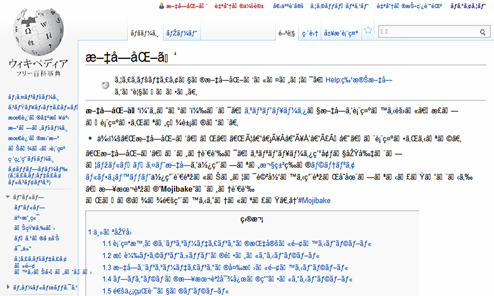
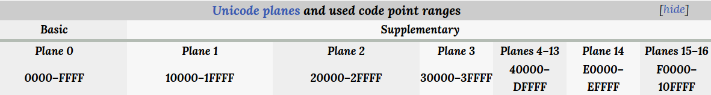
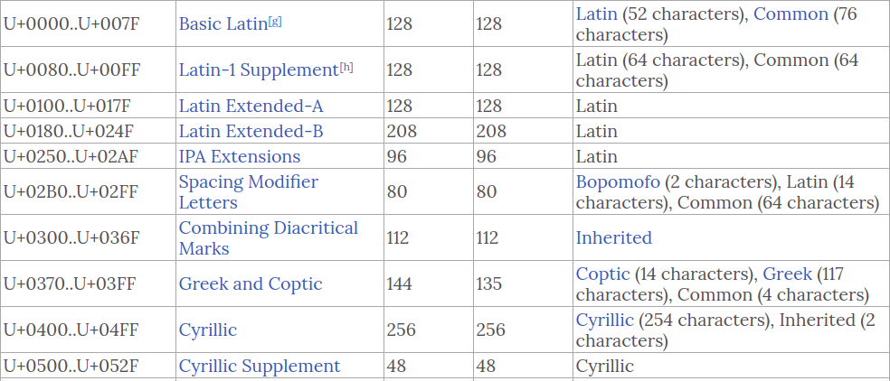
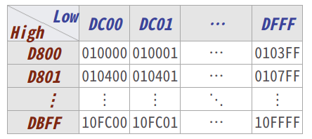
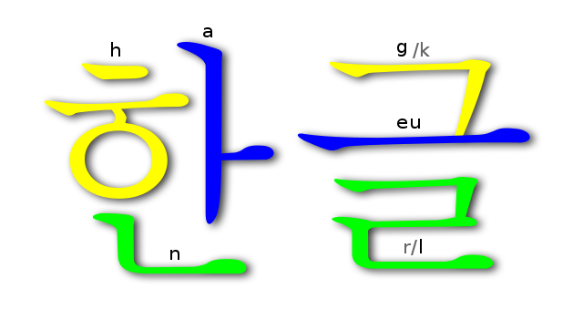

[//]: # "slide Markdown for remark"

class: center, middle

# Unicode 101

???
Speaker notes  
_Markdown_ also available here

---

# Agenda

1. Introduction
2. Terminologies
3. Unicode Encodings
4. Character Composition and Normalized Forms
5. Using Unicode in Your Application

---

class: center, middle

# Introduction

---

# In the Beginning

.center.img[

]

.footnote[
[ASCII: American Standard Code for Information Interchange](https://www.wikiwand.com/en/ASCII)
]

???
3 upper bits + 4 lower bits, max = 0x7F
control characters to specify how the characters are printed (on screen or on printer)
0x07: BEL (you computer would beep)
printable characters
0x5A: 'Z'

---

# ISO-646

- ASCII standardized as ISO-646, still 7-bits
- ASCII compatible (super set of ASCII)
- Added characters for different countries (National Replacement Character Set (NRCS))
- Greek, German, Spanish, Italian, Japannese, ...
- Can only pick **ONE**, no mixing in a single document

---

# ISO-8859

- 8-bits character sets, 15 of them
- For European languages using the Latin script
- ASCII compatible

---

# How 'bout CJK?

- They use ideographs (many of them) and cannot be fit into 8-bits
- Different 16-bits character sets are used in different countries
- Chinese:
  - Big 5 大五碼 (Taiwan, Hong Kong and Macau)  
    Some characters are not in Big 5 (e.g.: 邨, 鰂), HK government issued Hong Kong Supplementary Character Set (HKSCS) to cover those
  - GB 國標碼 (Mainland China, Singapore)
- Japanese: EUC-JP / Shift-JIS
- Korean: KS C 5601 / EUC-KR

---

# Big5 vs GB encoding

| Character |  Big5  |   GB   |
| :-------: | :----: | :----: |
|   `你`    | `A741` | `C4E3` |
|   `好`    | `A66E` | `BAC3` |
|   `世`    | `A540` | `CAC0` |
|   `界`    | `ACC9` | `BDE7` |
|   `！`    | `A149` | `A3A1` |

---

# What's your encoding?

- Now that we have multiple encodings, the user/application have to get the encoding right otherwise the text will be shown garbled
- There is _no_ fool proof way to detect encoding given the text
- This has long been the pain point of rendering CJK characters in the last century (well, the 90's)

---

# Garbles

.center.img[


We were frequently faced with this...
]

---

# Garbles

.center.img[


Or this...
]

---

# Unicode to save the world

- Unicode Consortium was formed in 1991 to publish and maintain the Unicode Standard
- Goals:
  - incorporate and unify encoding of all characters of current and historic writings (e.g.: cuneiform and hieroglyphs)
  - facilitates multilingual computer processing
- Unicode Standard 1.0 was published in 1991
- ISO/IEC 10646 synchronized with Unicode's character set since 1991  
  (only Unicode has rules for sorting, normalization, and right-to-left rendering)
- But Unicode adoption did not pick up until late 2000's

---

class: center, middle

# Terminologies

---

# Before we dive deeper

- Glyphs vs Characters
- Code Point, Character Set
- Planes, Blocks

---

# Glyphs vs Characters

- Glyph is the visual appearance of the character
- Character is the semantic units
- Unicode spec is on character, not glyph  
  _reference glyphs used in the standard are not prescriptive_
- Glyph controlled by the font used on renderer

---

# Code Points, Character Set

- **Character Set**: collection of characters that might be used by multiple languages
- **Coded Character Set**: a character set in which each character corresponds to a unique number
- **Code Point**: a numeric value in a coded character set that maps to a character
- **UCS**: Universal Coded Character Set, the characters defined in Unicode/ISO 10646
- We use `U+XXXX` to represent an Unicode code point

---

# Planes

- A [Unicode Plane](https://www.wikiwand.com/en/Plane_%28Unicode%29) consists of 65536 (2<sup>16</sup> = 65,535) code points
- There are 17 planes, Plane 0 is called [_Basic Multilingual Plane_ (BMP)](https://www.wikiwand.com/en/Plane_%28Unicode%29#/Basic_Multilingual_Plane)
- The syntax `U+XXXX` can represent all code points in BMP (and plane is omitted)
- For code pointes in supplementary planes an extra byte is added:  
  `U+PPXXXX` where `PP` is in 1<sub>16</sub> to 10<sub>16</sub>

.center.img[

]

---

# Blocks

- [Unicode block](https://www.wikiwand.com/en/Unicode_block) is defined as one contiguous range of code points
- Each block has unique name to specify the included code points

.center.img[

]

---

# A Look at Unicode standard

- The UCS are specified [in PDFs](https://www.unicode.org/charts/), each block correspond to one PDF
- It starts with a table of all code points and their glyphs
- Then a list of textual description of each code point  
   _reference glyphs used in the standard are not prescriptive_

* Unicode 6.0 in 2010 started to include emoticons
* [Emoticons block](https://www.unicode.org/charts/PDF/U1F600.pdf): range `U+1F600`–`U+1F64F` in Supplementary Plane 1

---

class: center, middle

# Unicode Encodings

---

# Unicode Encodings

- An Unicode code point have to go through [encodings](https://www.wikiwand.com/en/Character_encoding) to become a byte sequence
- **UTF-7**: 8-bits variable width encoding, ASCII compatible, used by some mail servers
- [**UTF-8**](https://www.wikiwand.com/en/UTF-8): 8-bits variable width encoding, ASCII
- ~~UCS-2~~: 16-bits fixed width encoding, only covers BMP, obsoleted by UTF-16
- [**UTF-16**](https://www.wikiwand.com/en/UTF-16): 16-bits variable width encoding, with surrogates to cover whole UCS
- [**UTF-32**](https://www.wikiwand.com/en/UTF-32): 32-bits fixed width encoding

.footnote[
what we transmit over network and store in memory are _encoded code points_, not the code points themselves
]

---

# Byte order in Multi-bytes Encoding

- We have to cater for byte order (endianess) in multi-bytes endcodings (UTF-16 and UTF-32)
- So these are the encoding schemes in Unicode standard:  
  UTF-16BE, UTF-16LE, UTF-32BE, and UTF-32LE
- A byte sequence `0x12, 0x34, 0x56, 0x78` is:
  - `U+1234, U+5678` in UTF-16BE
  - `U+3412, U+7865` in UTF-16LE
- The _byte order mark_ (BOM) character (`U+FEFF`) is used as first character in bitstream to indicate the byte order

---

# UTF-8 and UTF-16 encoding

This table shows the code points and encoding results in binary.

<table>
  <tr>
    <th rowspan="2"></th>
    <th rowspan="2">Code Point</th>
    <th rowspan="2">UTF-16</th>
    <th colspan="4">UTF-8</th>
  </tr>
  <tr>
    <td>1st Byte</td>
    <td>2nd Byte</td>
    <td>3rd Byte</td>
    <td>4th Byte</td>
  </tr>
  <tr>
    <td rowspan="3">BMP</td>
    <td><code>00000000 0xxxxxxx</code></td>
    <td><code>00000000 0xxxxxxx</code></td>
    <td><code>0xxxxxxx</code></td>
    <td></td>
    <td></td>
    <td></td>
  </tr>
  <tr>
    <td><code>00000yyy yyxxxxxx</code></td>
    <td><code>00000yyy yyxxxxxx</code></td>
    <td><code>110yyyyy</code></td>
    <td><code>10xxxxxx</code></td>
    <td></td>
    <td></td>
  </tr>
  <tr>
    <td><code>zzzzyyyy yyxxxxxx</code></td>
    <td><code>zzzzyyyy yyxxxxxx</code></td>
    <td><code>1110zzzz</code></td>
    <td><code>10yyyyyy</code></td>
    <td><code>10xxxxxx</code></td>
    <td></td>
  </tr>
  <tr>
    <td>Supp.<br>Planes</td>
    <td><code>000uuuuu zzzzyyyy<br>yyxxxxxx</code></td>
    <td><code>110110ww wwzzzzyy<br>110111yy yyxxxxxx</code></td>
    <td><code>11110uuu</code></td>
    <td><code>10uuzzzz</code></td>
    <td><code>10yyyyyy</code></td>
    <td><code>10xxxxxx</code></td>
  </tr>
</table>

In UTF-16 surrogates, `uuuuu` = `wwww + 1`.

---

# UTF-16 Summary

- BMP code points are represented as is
- 2048 ["Surrogates"](https://www.wikiwand.com/en/UTF-16#/U+010000_to_U+10FFFF) reserved to represent code points  
  in Supplementary planes
- 1024 High Surrogate (`U+D800`–`U+DBFF`)
- 1024 Low Surrogate (`U+DC00`–`U+DFFF`)

.center.img[

]

---

# UTF-8 Summary

- ASCII code points are represented as is
- Leading `1`s in first byte (will be followed by a `0`) indicates  
  the length of the UTF-8 encoding
- Remaining bytes for the code point starts with `10`
- BMP can be encoded in 3 bytes
- Whole UCS can be encoded in at most 4 bytes
- No worse than UTF-32
- **THIS SHOULD BE THE DEFAULT ENCODING**

---

class: center, middle

# Character Composition and

# Normalized Forms

---

# Character Composition

.split-50[
.column[
| Precomposed<br/>Character | Base<br/>Character | Diacritical<br/>Mark |
| :-----------------------: | :----------------: | :------------------: |
| [`ä`][1] (`U+00E4`) | `a` (`U+0061`) | `̈` (`U+0308`) |
| [`å`][2] (`U+00E5`) | `a` (`U+0061`) | `̊` (`U+030A`) |
| [`Ç`][3] (`U+00C7`) | `C` (`U+0043`) | `̧` (`U+0327`) |
[1]: http://unicode.scarfboy.com/?s=U%2b00E4
[2]: http://unicode.scarfboy.com/?s=U%2b00E5
[3]: http://unicode.scarfboy.com/?s=U%2b00C7
]
.column[

.img[

]

Composition is also applicable for [Korean Hangul](https://www.wikiwand.com/en/Hangul).

]
]

.footnote[
[Precomposed character - Wikiwand](https://www.wikiwand.com/en/Precomposed_character)  
[Combining Diacritical Marks - Wikiwand](https://www.wikiwand.com/en/Combining_Diacritical_Marks)  
[Combining Diacritical Marks](https://www.unicode.org/charts/PDF/U0300.pdf): range `U+0300`–`U+036F`
]

---

# Normalization

- [`ǻ`](http://unicode.scarfboy.com/?s=U%2b01FB) could be `ǻ`, `å` + `́` or `a` + `̊` + `́`
- Unicode defined two [equivalence](https://www.wikiwand.com/en/Unicode_equivalence): canonical and compatible  
  (we won't dive into the details here)
- Each equivalence has composition and decomposition form
- Creating 4 normalized forms in Unicode
- The decomposed form of `ǻ`: `a` + `̊` + `́`
- The composed form of `ǻ`: `ǻ`

---

class: center, middle

# Using Unicode

# in Your Application

---

# Using Unicode

- Use established Unicode libraries  
  Do not use home brew code, there are many edge cases
- I hope this presentation can help you understand the libraries' API and usage
- Use UTF-8 by default
- Remember the encode and decode process
- Python 3 is very explicit on this:
  - Strings encodes to bytes
  - Bytes decode to strings
  - You can read bytes from data source (binary mode) or  
    pass an encoding to parse them to string (text mode)

---

# Trying this out

```py
def encode(s, encoding):
    coded = s.encode(encoding)
    print('=>', encoding )
    print(type(coded), coded.hex())
    print()


s = '你好世界！'
print(type(s), s)
print([hex(ord(c)) for c in s])
print()

encode(s, 'utf-8')
encode(s, 'utf-16')
encode(s, 'utf-16le')
encode(s, 'utf-16be')
encode(s, 'utf-32')
```

.footnote[
[Python 3 code](./unicode.py)
]

---

# Output

```
<class 'str'> 你好世界！
['0x4f60', '0x597d', '0x4e16', '0x754c', '0xff01']

=> utf-8
<class 'bytes'> e4bda0e5a5bde4b896e7958cefbc81

=> utf-16
<class 'bytes'> fffe604f7d59164e4c7501ff

=> utf-16le
<class 'bytes'> 604f7d59164e4c7501ff

=> utf-16be
<class 'bytes'> 4f60597d4e16754cff01

=> utf-32
<class 'bytes'> fffe0000604f00007d590000164e00004c75000001ff0000
```

---

class: center, middle

# .red[♥] Thanks all .red[♥]

## Q & A
